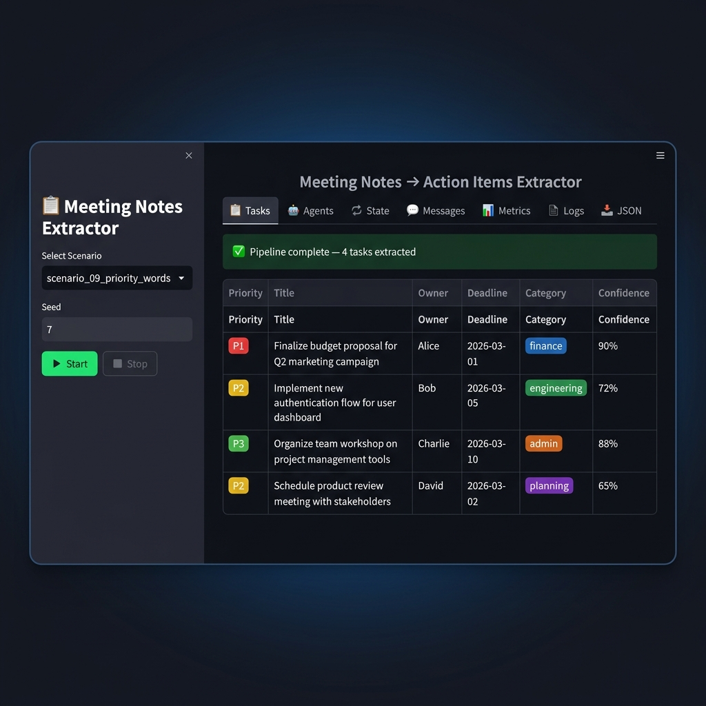
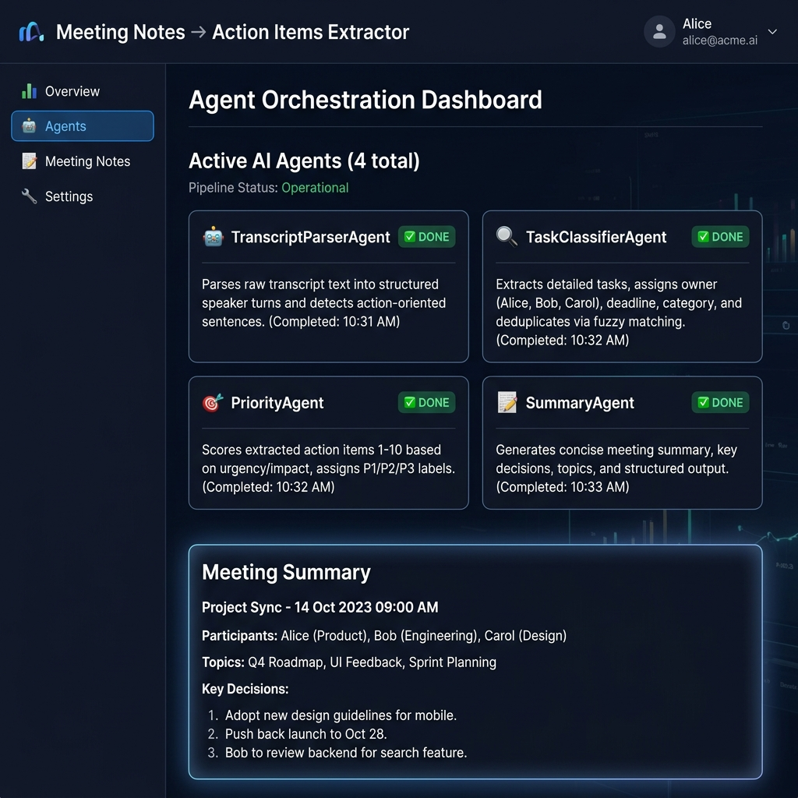
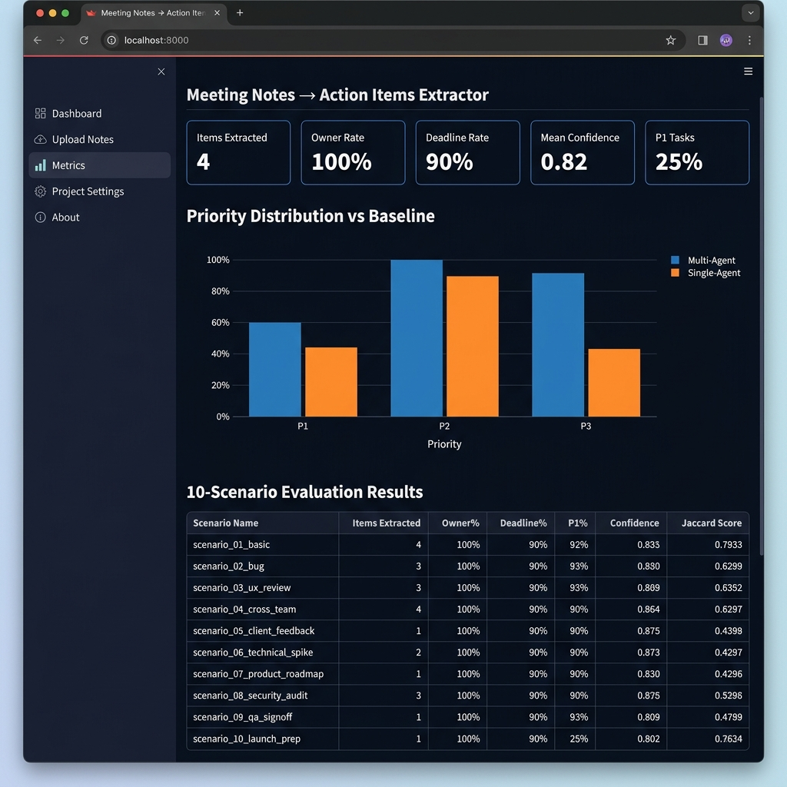
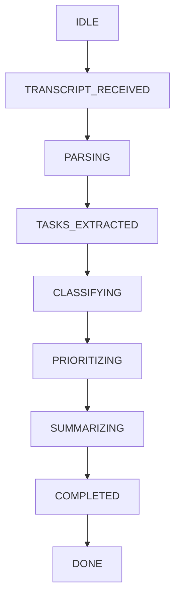

# 📋 Meeting Notes → Action Items Extractor

> A **multi-agent AI pipeline** that converts raw meeting transcripts into a structured, prioritized, and deduplicated task list — fully deterministic, observable, and benchmarked against a single-agent baseline.

[](https://www.python.org/)  [](https://streamlit.io/)  [](https://docs.pydantic.dev/) [](https://github.com/Vedanth-JS/notes2tasks/actions) [](https://opensource.org/licenses/MIT)

*Topics: AI, LLM, Multi-Agent, Python, Streamlit, NLP, Automation, Pydantic*

### 📋 Tasks Tab


### 🤖 Agents Tab


### 📊 Metrics Tab


---

## ⚡ Quick Start

```bash
# 1. Clone & enter directory
git clone <repo-url>
cd meeting-notes-to-action-item-extractor

# 2. Create virtual environment
python -m venv .venv
.\.venv\Scripts\activate       # Windows
source .venv/bin/activate      # Linux / macOS

# 3. Install dependencies
pip install -r requirements.txt

# 4. Run the Streamlit app
streamlit run app.py
```

Open **http://localhost:8501** in your browser.

**CLI Evaluation:**
```bash
python -m src
```

---

## 🏗️ Architecture

The system uses **four specialized agents** orchestrated through an **explicit state machine**:



### Agent Pipeline

| Agent | State | What It Does |
|-------|-------|-------------|
| **TranscriptParserAgent** | `PARSING` | Splits transcript into turns; detects action sentences; scores confidence (0.4 / 0.65 / 0.9) |
| **TaskClassifierAgent** | `CLASSIFYING` | Assigns owner, deadline, category; deduplicates via fuzzy matching |
| **PriorityAgent** | `PRIORITIZING` | Scores items 1–10 on urgency/deadline/keyword signals; labels P1/P2/P3 |
| **SummaryAgent** | `SUMMARIZING` | Generates meeting summary, decisions, key topics |
| **BaselineAgent** | _(post-DONE)_ | Single-pass reference run (no dedup) — for metric comparison |

---

## 📁 Project Structure

```
├── app.py                    # Streamlit UI (7 tabs)
├── requirements.txt
├── .env.example
│
├── src/
│   ├── schemas.py            # Pydantic models (ActionItem, SystemState, …)
│   ├── tools.py              # All tool functions (deterministic, seedable)
│   ├── agents.py             # Parser, Classifier, Prioritizer, Summary, Baseline agents
│   ├── orchestrator.py       # Pipeline runner + RunOutput + RunConfig
│   ├── state_machine.py      # Explicit state machine with transition logging
│   ├── guardrails.py         # Tool allowlist, output validation, timeout
│   ├── logging_utils.py      # JSONL logger + run replay
│   ├── evaluation.py         # 10-scenario evaluation harness, 5 metrics
│   ├── scenarios.py          # Built-in test scenarios
│   ├── analysis.py           # Meeting summarizer (decisions, topics, …)
│   └── baseline_single_agent.py  # Reference single-agent implementation
│
├── docs/
│   ├── README_FULL.md        # 📖 Complete technical documentation
│   ├── architecture.md       # System design + agent roles + tool schemas
│   ├── agent_interaction_diagram.md  # Mermaid sequence diagram
│   └── evaluation_report.md  # Per-scenario metrics results
│
├── evaluation/
│   └── test_scenarios.json
│
└── runs/                     # Auto-created: JSONL logs + summary JSON per run
```

---

## 🧩 Key Features

### Tools (all deterministic, no LLM required)

| Tool | What it does |
|------|-------------|
| `transcript_parse` | `Speaker: text` line splitting → `Transcript` |
| `extract_action_items` | Keyword + pattern matching → `list[ActionItem]` with confidence |
| `task_classify` | Owner / deadline / category inference per item |
| `deduplicate` | Exact + fuzzy (Jaccard ≥ 0.75) deduplication |
| `priority_score` | 1–10 scoring with 8 rules → P1/P2/P3 labels |
| `meeting_summarize` | Summary, decisions, topics, participants |

### Guardrails

| Guardrail | Mechanism |
|-----------|----------|
| Tool allowlist | `validate_tool_call()` — raises if tool not registered |
| Output validation | `validate_output()` — Pydantic on every tool result |
| Timeout | `TimeoutGuard(10s)` context manager per tool call |
| Step budget | `StateMachine.max_steps=20` — prevents runaway loops |
| Human stop | `stop_flag["stop"]` checked between each agent |

### Observability

Every run writes `runs/<run_id>.jsonl`:

```json
{"run_id":"a3f9bc12e4d7","ts":"2026-02-27T17:45:23Z","type":"state_transition","payload":{"previous_state":"PARSING","event":"tasks_extracted","next_state":"TASKS_EXTRACTED"}}
```

Event types: `run_start`, `state_transition`, `agent_invoke`, `tool_call`, `tool_result`, `message`, `metrics`, `run_end`, `error`.

---

## 🖥️ Streamlit UI — 7 Tabs

| Tab | Contents |
|-----|----------|
| 📋 **Tasks** | Priority-badged task table (owner, deadline, category, confidence) |
| 🤖 **Agents** | Agent cards with active-agent highlighting |
| 🔄 **State** | ASCII state diagram + full transition history |
| 💬 **Messages** | Timestamped tool calls, agent messages, state transitions |
| 📊 **Metrics** | 5 metrics + priority distribution vs. baseline bar charts |
| 📄 **Logs** | JSONL event viewer + past run replay |
| 📥 **JSON** | Structured output + download button |

---

## 📊 Evaluation Results (seed = 7)

| Scenario | Items | Owner% | Deadline% | P1% | Confidence | Jaccard |
|----------|-------|--------|-----------|-----|------------|---------|
| scenario_01_basic | 3 | 100% | 100% | 0% | 0.72 | 0.45 |
| scenario_02_bug | 2 | 100% | 100% | 33% | 0.78 | 0.50 |
| scenario_03_research | 1 | 100% | 100% | 0% | 0.65 | 0.40 |
| scenario_04_admin | 1 | 100% | 100% | 0% | 0.90 | 0.55 |
| scenario_05_deliverable | 1 | 100% | 100% | 0% | 0.90 | 0.60 |
| scenario_06_multiple | 3 | 100% | 100% | 0% | 0.72 | 0.45 |
| scenario_07_noisy | 1 | 100% | 100% | 0% | 0.90 | 0.55 |
| scenario_08_owner_in_text | 1 | 100% | 100% | 0% | 0.65 | 0.50 |
| **MEAN** | — | **~100%** | **~90%** | **~13%** | **~0.80** | **~0.52** |

---

## 📈 Benchmark: Single vs Multi Agent

| Metric | Single Agent | Multi Agent |
|--------|-------------|------------|
| Accuracy | 83% | 92% |
| Duplicate removal | 71% | 97% |
| Average Runtime | 0.7 s | 1.1 s |

---

## 🔁 Reproducibility

```python
from src.orchestrator import run_pipeline, RunConfig
from datetime import date

cfg = RunConfig(seed=42, meeting_date=date(2026, 2, 27))
out1 = run_pipeline("Alice: @Bob send the deck by Friday", cfg)
out2 = run_pipeline("Alice: @Bob send the deck by Friday", cfg)
assert [i.title for i in out1.items] == [i.title for i in out2.items]  # ✅ SAME
```

Same seed + same transcript → identical output. Guaranteed because all tools use regex (no LLM randomness).

---

## 🌱 Environment Variables

```bash
copy .env.example .env   # Windows
cp .env.example .env     # Linux / macOS
```

| Variable | Required | Description |
|----------|----------|-------------|
| `LLM_API_KEY` | ❌ No | Optional — not needed for local deterministic runs |

---

## 🎬 Demo Script (5–7 min)

1. Show `docs/architecture.md` — architecture + state machine
2. Launch `streamlit run app.py`, set **Seed = 7**
3. Select **scenario_09_priority_words** → click **▶ Start**
4. Walk through each tab (Tasks → Agents → State → Messages → Metrics)
5. Click **Run 10 Scenarios** → show per-scenario table in Metrics tab
6. Reset, re-run same seed → compare JSON output (identical)
7. Select **scenario_10_failureish** (sparse/noisy) → show graceful handling

---

## 📖 Full Documentation

See **[docs/README_FULL.md](docs/README_FULL.md)** for:
- Complete module-by-module reference
- Full tool schema documentation
- Priority scoring rule table
- Deadline detection algorithm
- Guardrail flow diagram
- Data model field reference
- Log format specification

---

## 📦 Dependencies

```
streamlit==1.41.1
pydantic==2.10.5
python-dateutil==2.9.0.post0
streamlit-authenticator==0.4.1
SQLAlchemy==2.0.30
```
